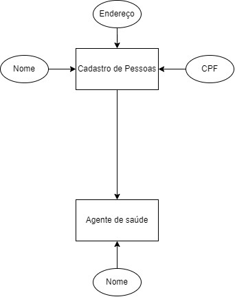

# Seminários 3 - Sistema para Atualização Cadastral da população

Disciplina de Seminários III
Professor Msc. Harrison Herman Silva

- Giulia Ramos Bagodi
- Mateus Pereira de Oliveira
- Octávio Patrocínio Martins
- Yuri Stockler

## 1. Introdução
  Esporadicamente os agentes de saúde precisam passar nas residências para verificar se houve mudanças no cadastro dos moradores. O sistema a ser desenvolvido pode auxiliar equipes, através de visualização de mapas, para demonstrar visualmente os endereços atualizados e as regiões que ainda precisam ser visitadas.

### 1.1 Objetivo
  Tendo em vista a necessidade e praticidade dos agentes de saúde terem o cadastro dos seus pacientes e moradores cadastrados, o principal objetivo do desenvolvimento do sistema é a facilidade de visualização e praticidade do sistema.
  Ao final do desenvolvimento, o agente de saúde poderá visualizar todos os moradores cadastrados de forma rápida e direta, podendo, por exemplo clicar ou interagir com um endereço de determinado morador para visualizar diretamente no mapa onde é o local.

  ## 2. Desenvolvimento
  
  O desenvolvimento de um sistema com aplicação será desenvolvido com PowerApps buscando de forma significativa uma elaboração de um pequeno sistema totalmente personalizado para atender o usuário. O PowerApps, uma ferramenta da Microsoft, permite que usuários, mesmo sem profundo conhecimento em programação, desenvolvam aplicativos funcionais e interativos de forma ágil. Essa abordagem coloca o controle nas mãos dos próprios usuários e agiliza o processo de criação de aplicativos sob medida para atender às necessidades específicas conforme necessário. Este paradigma inovador não apenas simplifica o desenvolvimento, mas também oferece flexibilidade e adaptabilidade essenciais em um ambiente de constante evolução. Neste contexto, exploraremos as vantagens, os desafios e as possibilidades que surgem ao abordar o desenvolvimento de sistemas através do PowerApps, demonstrando como essa abordagem poderá simplificar o uso.
  Para a produção e desenvolvento do aplicativo iremos utilizar do GitHub, para atualizações e descrições das funcionalidades implementadas e a plataforma Microsoft PowerApps Make, com suas funcionalidades sendo totalmente produzidas internamente, acesso para atualizações de funcionalidades: <a href="https://github.com/ICEI-PUC-Minas-PPC-CC/SeminariosIII-Cadastro/blob/main/Funcionalidades/Atualiza%C3%A7%C3%B5es.md">Funcionalidades</a>.

### 2.1 Aplicação

  A ideia central da aplicação se baseia no protótipo acima, sendo incialmente proposto três telas, sendo elas uma tela inicial, uma tela de cadastros e atualizações com endereços e uma tela com a visualização do mapa.

#### 2.1.1 Tela 1

  A tela um deverá conter uma pré-visualização do mapa geral para que o usuário possa visualizar de acordo com o cadastro no banco de dados interno da aplicação, tendo no banco informações de Nome das Pessoas e seus respectivos endereços, se o usuário clicar no mapa ele será enviado para a "Tela 3"; Abaixo do mapa o usuário terá uma opção de visualizar o cadastro registrado no sistema, podendo ele apenas visualizar o conteúdo ou editar as informações, se clicar na funcionalidade ele será enviado para a "Tela 2" e logo abaixo da primeira Tela terá a logo da Instituição PUC Minas.

#### 2.1.2 Tela 2

  A tela 2 contará com uma logo da Universidade PUC Minas em seu topo, e logo abaixo em formato de tabela uma visualização de todo o banco de dados com o cadastro de pessoas para que o agente de saúde possa visualizar, se clicar em cima será possível editar as informações.
  O banco de dados terá como característica sua separação em 2 colunas podendo ter quantas linhas necessárias, sendo uma coluna para o Nome da pessoa e outra coluna com o endereço da pessoa, cada linha corresponderá com um cadastro exclusivo e se o usuário clicar em cima do nome da pessoa, irá editar o nome, se clicar no endereço será possível editar o endereço referente a pessoa cadastrada em questão, o usuário também terá as opções de "Salvar" e "Voltar para o início" que o enviará para a "Tela 1" e ua opção de "Visualizar no mapa" que o enviará para a "Tela 3".

#### 2.1.3 Tela 3

  A tela 3 também terá a logo da PUC Minas no topo e logo abaixo será possivel uma visualização do mapa com os locais cadastrados na "Tela 2", podendo visualizar direto no mapa onde é o endereço cadastrado e referente a de qual pessoa se trata, o usuário também terá a opção de voltar a "Tela de cadastros" (Tela 2) ou "Voltar a tela inicial" (Tela 1).

## 3. Modelo Conceitual do Banco de Dados

  O Banco de Dados será simples tendo a entidade Cadastro, referente ao cadastro de pessoas para os agentes de saúde visualizarem e uma entidade agente, que será o agente de saúde que cadastrou e está se utlizando da aplicação.
  A entidade Cadastro, terá como principais atributos seu Nome, Endereço e seu CPF como "ID" e a entidade "Agente" terá como atributos "Nome" para saber qual agente de saúde está cadastrando e atualizando as informações.

  

  obs: Este modelo é apenas um protótipo, será atualizado e melhorado a medida que o desenvolvimento se avançar.
